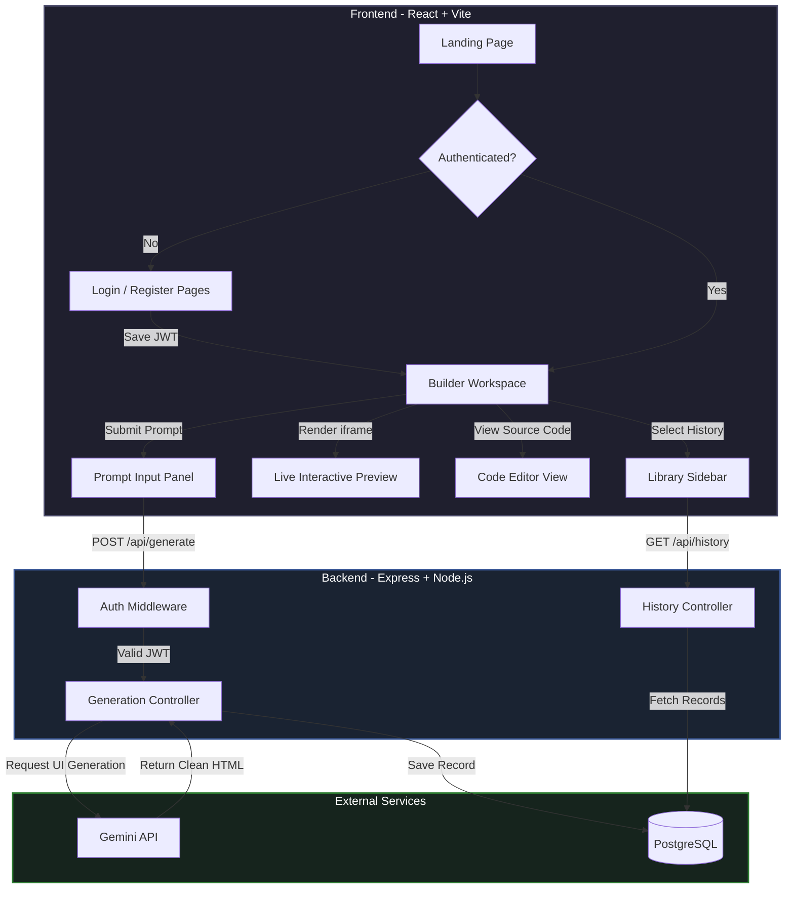
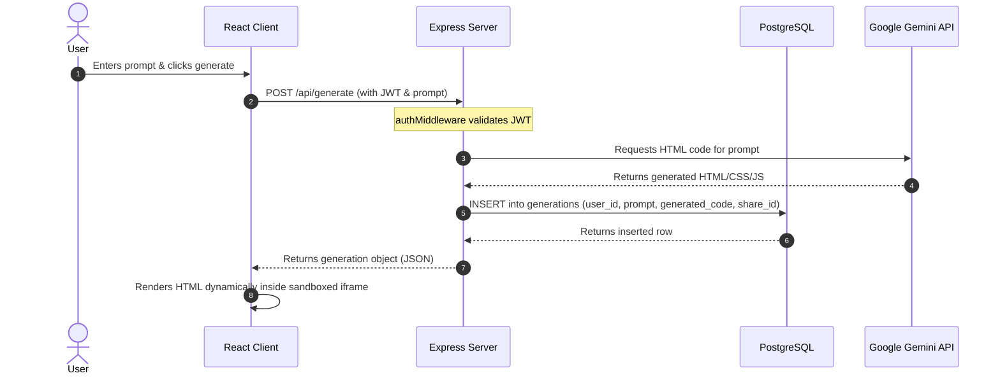
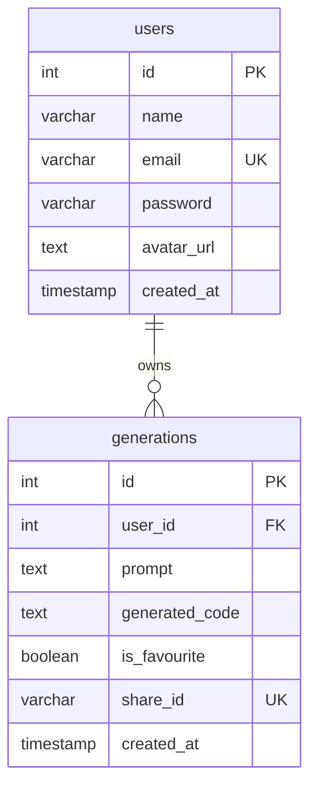

<div align="center">

```text
                                    ███████╗██████╗  █████╗ ██████╗ ██╗  ██╗
                                    ██╔════╝██╔══██╗██╔══██╗██╔══██╗██║ ██╔╝
                                    ███████╗██████╔╝███████║██████╔╝█████╔╝
                                    ╚════██║██╔═══╝ ██╔══██║██╔══██╗██╔═██╗
                                    ███████║██║     ██║  ██║██║  ██║██║  ██╗
                                    ╚══════╝╚═╝     ╚═╝  ╚═╝╚═╝  ╚═╝╚═╝  ╚═╝
```

# Spark

**AI-powered UI Builder for rapid prompt-to-interface generation**

Generate polished interfaces from natural language, preview instantly, and refine through a chat-style workflow.

[](https://nodejs.org)
[](https://react.dev)
[](https://vite.dev)
[](https://www.postgresql.org)

[Features](#-features) · [Tech Stack](#-tech-stack) · [Application Flow](#-application-process--user-flow) · [Database Schema](#-database-schema) · [API Reference](#-api-reference) · [Environment Variables](#-environment-variables)

</div>

---

## ✨ Features

Spark lets you describe any UI in plain English and instantly generates a fully functional HTML/CSS/JS interface. Refine your designs through a conversational chat-style builder, toggle between a live interactive preview and raw source code, and manage all your past generations from a scrollable library sidebar — all behind a secure JWT-authenticated workflow with persistent PostgreSQL storage.

---

## 🛠 Tech Stack

### Frontend

| Technology       | Purpose                                         |
| ---------------- | ----------------------------------------------- |
| React 19 + Vite  | SPA framework and build tooling                 |
| React Router DOM | Client-side routing and protected navigation    |
| Axios            | API client with auth token interceptor          |
| Lucide React     | UI icons                                        |
| Custom CSS       | Branded UI for landing/auth/builder experiences |

### Backend

| Technology               | Purpose                                      |
| ------------------------ | -------------------------------------------- |
| Node.js + Express        | REST API server                              |
| PostgreSQL (`pg`)        | User and generation persistence              |
| JSON Web Tokens          | Stateless auth for protected routes          |
| bcryptjs                 | Password hashing                             |
| Google Generative AI SDK | Gemini-powered UI code generation            |
| CORS + dotenv            | Environment configuration and origin control |

### External Services

| Service                                                          | Purpose                             | Notes                                         |
| ---------------------------------------------------------------- | ----------------------------------- | --------------------------------------------- |
| [Google AI Studio / Gemini](https://aistudio.google.com)         | Model inference for code generation | Requires `GEMINI_API_KEY`                     |
| [Supabase Postgres](https://supabase.com) or any PostgreSQL host | Production database                 | SSL config is already enabled in backend pool |

---

## 🧭 Application Process & User Flow

### 1. Process Architecture Flow



### 2. Prompt-to-Code Generation Lifecycle



### 3. Step-by-Step User Actions
1. **Discover** — Land on the marketing homepage.
2. **Authenticate** — Register or log in to access the builder.
3. **Prompt** — Enter a design idea into the input field.
4. **Generate** — The backend queries Gemini, saves the result to PostgreSQL, and issues a unique share link.
5. **Preview** — View the rendered output in a sandboxed iframe or inspect the raw source code.
6. **Iterate** — Send follow-up prompts to refine the current layout.
7. **Manage** — Browse the library sidebar to star favorites, delete old builds, or reload past generations.

---

## 🔐 Authentication Flow

1. User registers or logs in through `/api/auth/*`.
2. Backend returns a JWT (24h expiry).
3. Frontend stores token in localStorage.
4. Axios interceptor attaches `Authorization: Bearer <token>` to API calls.
5. Protected routes validate token through middleware.

---

## 🗄 Database Schema



### Table Structure

#### `users` Table
| Column | Type | Constraints | Description |
| :--- | :--- | :--- | :--- |
| `id` | `SERIAL` | `PRIMARY KEY` | Unique identifier for the user |
| `name` | `VARCHAR(100)` | `NOT NULL` | Full name of the user |
| `email` | `VARCHAR(150)` | `NOT NULL, UNIQUE` | Unique email for authentication |
| `password` | `VARCHAR(255)` | `NOT NULL` | Hashed password of the user |
| `avatar_url` | `TEXT` | `NULL` | Optional URL of the user's avatar image |
| `created_at` | `TIMESTAMP` | `NOT NULL, DEFAULT NOW()` | Date and time of user registration |

#### `generations` Table
| Column | Type | Constraints | Description |
| :--- | :--- | :--- | :--- |
| `id` | `SERIAL` | `PRIMARY KEY` | Unique identifier for the generation |
| `user_id` | `INT` | `NOT NULL, REFERENCES users(id) ON DELETE CASCADE` | Foreign key referencing the owner of the generation |
| `prompt` | `TEXT` | `NOT NULL` | The input prompt sent by the user |
| `generated_code` | `TEXT` | `NOT NULL` | The generated HTML/CSS/JS source code |
| `is_favourite` | `BOOLEAN` | `NOT NULL, DEFAULT FALSE` | Flag indicating if the generation is starred/favorited |
| `share_id` | `VARCHAR(50)` | `UNIQUE` | Unique random slug for share links |
| `created_at` | `TIMESTAMP` | `NOT NULL, DEFAULT NOW()` | Date and time when the UI code was generated |

- **Index**: `idx_generations_user` on `generations(user_id)` for high-performance retrieval of user generation logs.

---

## 📡 API Reference

Base URL: `http://localhost:5000`

### Auth

| Method | Endpoint             | Description                      | Auth |
| ------ | -------------------- | -------------------------------- | ---- |
| `POST` | `/api/auth/register` | Create a new user and return JWT | ❌   |
| `POST` | `/api/auth/login`    | Login and return JWT             | ❌   |

### Generation

| Method | Endpoint        | Description                                     | Auth |
| ------ | --------------- | ----------------------------------------------- | ---- |
| `POST` | `/api/generate` | Generate UI code from prompt and persist result | ✅   |

### History

| Method   | Endpoint                     | Description                                           | Auth |
| -------- | ---------------------------- | ----------------------------------------------------- | ---- |
| `GET`    | `/api/history`               | Fetch all past generations for the authenticated user | ✅   |
| `DELETE` | `/api/history/:id`           | Delete a specific logged generation                   | ✅   |
| `PATCH`  | `/api/history/:id/favourite` | Toggle favorite state for a generation                | ✅   |

### Health

| Method | Endpoint | Description       |
| ------ | -------- | ----------------- |
| `GET`  | `/`      | API running check |

---

## 🔒 Environment Variables

### `backend/.env`

| Variable         | Required | Description                     |
| ---------------- | -------- | ------------------------------- |
| `PORT`           | ❌       | Server port (default: `5000`)   |
| `FRONTEND_URL`   | ✅       | Frontend origin allowed by CORS |
| `DATABASE_URL`   | ✅       | PostgreSQL connection string    |
| `JWT_SECRET`     | ✅       | Secret used to sign/verify JWT  |
| `GEMINI_API_KEY` | ✅       | API key for Gemini model access |

### `frontend/.env`

| Variable       | Required | Description                                         |
| -------------- | -------- | --------------------------------------------------- |
| `VITE_API_URL` | ❌       | Backend base URL (default: `http://localhost:5000`) |

---

## 🧪 Scripts

### Backend (`backend/package.json`)

| Script  | Command             | Purpose                        |
| ------- | ------------------- | ------------------------------ |
| `start` | `node server.js`    | Run backend in production mode |
| `dev`   | `nodemon server.js` | Run backend with auto-reload   |

### Frontend (`frontend/package.json`)

| Script    | Command        | Purpose                          |
| --------- | -------------- | -------------------------------- |
| `dev`     | `vite`         | Start development server         |
| `build`   | `vite build`   | Create production build          |
| `preview` | `vite preview` | Preview production build locally |
| `lint`    | `eslint .`     | Lint frontend source             |

---

## 📄 License

No license file has been added yet. Add a `LICENSE` file before open-source distribution.

---

<div align="center">

Built by [subxm](https://github.com/subxm)

If Spark helped you, consider starring the repo ⭐

</div>
